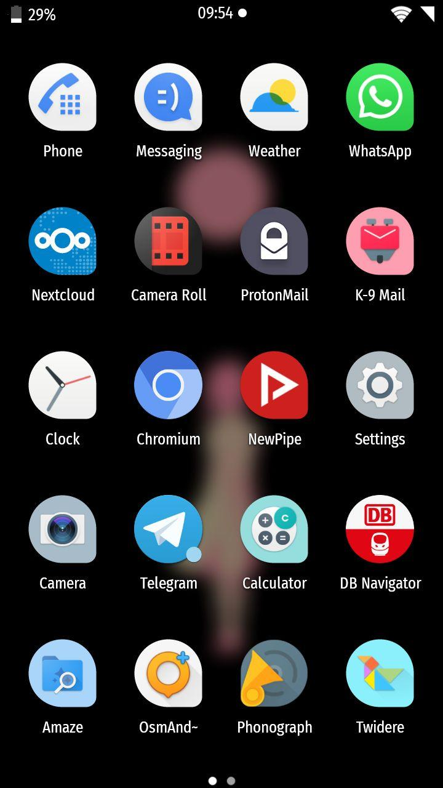

# Fira Sans Condensed for Magisk
Install **Fira Sans Condensed** as your default font systemless-ly  
  
## Instructions
* Clone this repo
* ZIP it
* Install the ZIP file via Magisk or a custom recovery (e.g. TWRP)
* Reboot

## Credits
* [Mozilla](https://github.com/mozilla/Fira) for the font
* [Mike_Went](https://github.com/MikeWent/magisk-roboto-condensed/) for similiar Magisk module, which mine is based on
